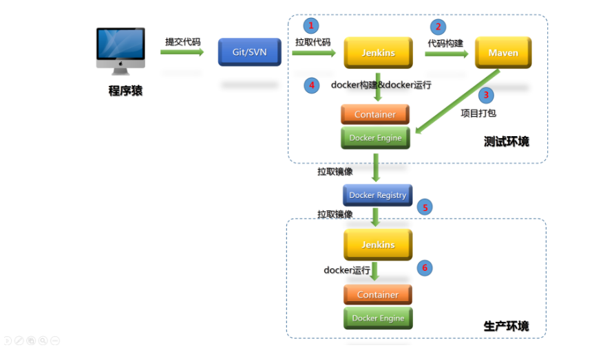

# Pipeline 介绍
 要实现在 Jenkins 中的构建工作，可以有多种方式，我们这里采用比较常用的 Pipeline 这种方式。Pipeline，简单来说，就是一套运行在 Jenkins 上的工作流框架，将原来独立运行于单个或者多个节点的任务连接起来，实现单个任务难以完成的复杂流程编排和可视化的工作。

 ### 总体架构
 在开始我们的工作之前，让我们花一点时间分析开始使用Jenkins使用Kubernetes容器所需的工作流。Kubernetes对于开发者来说是一个惊人的开源容器编排引擎。Kubernetes是由Google发起的，这使Kubernetes在使用多个开源容器项目方面有一个惊人的优势。默认情况下，Docker更受Kubernetes的使用者支持和青睐。使用Docker容器的工作流程如下图所示：

 
### k8s Jenkins构建持续集成流程
 
 ### Docker技术这些应用场景
 参考文档:https://blog.csdn.net/xiegh2014/article/details/80456486
 ### 部署准备
 ```
 pass
 ```
 ### 安装步骤
 创建namespace命名空间:
 ```
 kubectl create namespace kube-jenkins
 创建PVC对象：
 kubectl create -f 
 创建rbac相关的资源对象:
 kubectl create -f 
 创建Jenkins服务:
 kubectl create -f jenkins.yaml
 ```
 ### 传统CICD存在的问题
 Jenkins 安装完成了，接下来我们不用急着就去使用，我们要了解下在 Kubernetes 环境下面使用 Jenkins 有什么好处。

 我们知道持续构建与发布是我们日常工作中必不可少的一个步骤，目前大多公司都采用 Jenkins 集群来搭建符合需求的 CI/CD 流程，然而传统的 Jenkins Slave 一主多从方式会存在一些痛点，比如：

 - 主 Master 发生单点故障时，整个流程都不可用了
 - 每个 Slave 的配置环境不一样，来完成不同语言的编译打包等操作，但是这些差异化的配置导致管理起来非常不方便，维护起来也是比较费劲
 - 资源分配不均衡，有的 Slave 要运行的 job 出现排队等待，而有的 Slave 处于空闲状态
 - 资源有浪费，每台 Slave 可能是物理机或者虚拟机，当 Slave 处于空闲状态时，也不会完全释放掉资源。
 ### 优点
 正因为上面的这些种种痛点，我们渴望一种更高效更可靠的方式来完成这个 CI/CD 流程，而 Docker 虚拟化容器技术能很好的解决这个痛点，又特别是在 Kubernetes 集群环境下面能够更好来解决上面的问题，下图是基于 Kubernetes 搭建 Jenkins 集群的简单示意图：
 - 服务高可用，当 Jenkins Master 出现故障时，Kubernetes 会自动创建一个新的 Jenkins Master 容器，并且将 Volume 分配给新创建的容器，保证数据不丢失，从而达到集群服务高可用。
 - 动态伸缩，合理使用资源，每次运行 Job 时，会自动创建一个 Jenkins Slave，Job 完成后，Slave 自动注销并删除容器，资源自动释放，而且 Kubernetes 会根据每个资源的使用情况，动态分配 Slave 到空闲的节点上创建，降低出现因某节点资源利用率高，还排队等待在该节点的情况。
 - 扩展性好，当 Kubernetes 集群的资源严重不足而导致 Job 排队等待时，可以很容易的添加一个 Kubernetes Node 到集群中，从而实现扩展。
 ### 沟通交流

 k8s-CICD-Pipeline交流群:18876939 欢迎喜欢交流的朋友加入！
